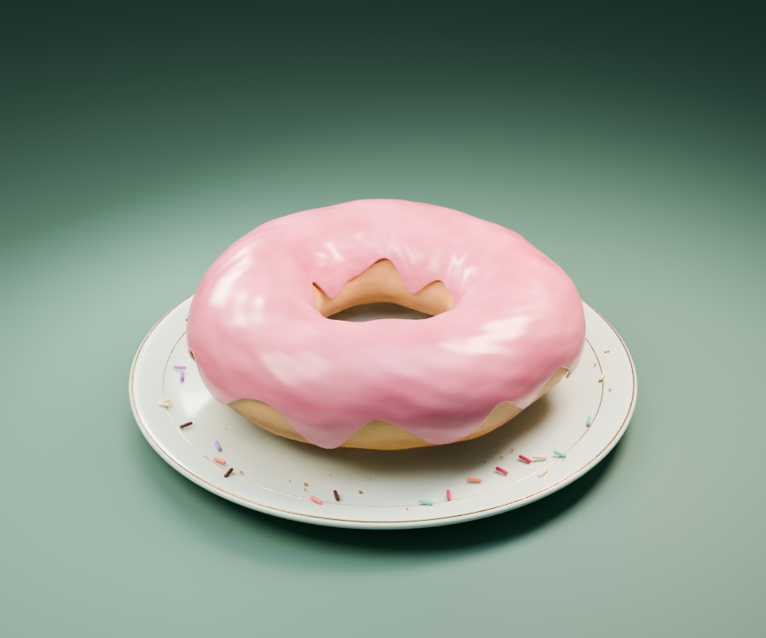
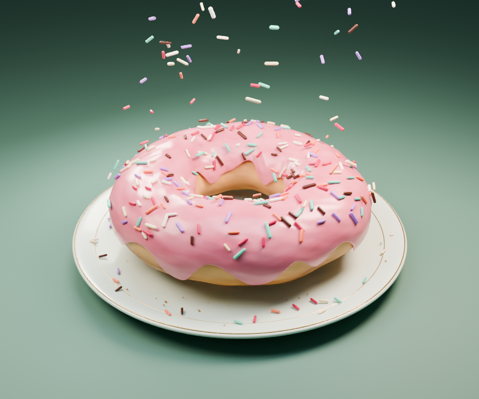
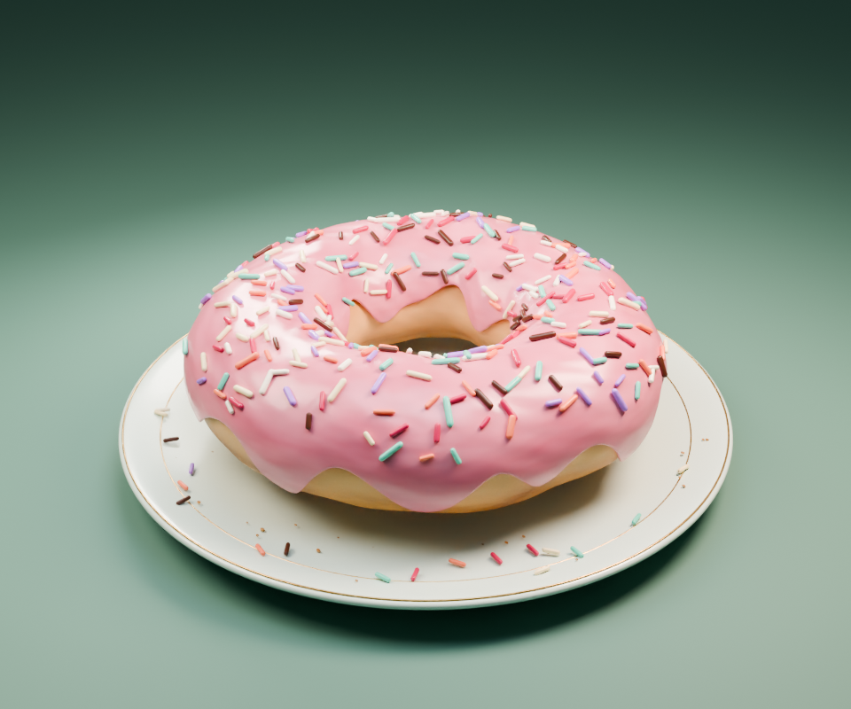

# Sugarfall · 草莓甜甜圈

可编辑的 Blender 甜点场景：金黄烘焙外皮、粉色草莓糖霜、**310 粒彩色圆柱糖粒**、青瓷金边餐盘，以及糖粒下落、旋转、轻微弹跳和缓慢绕行的摄影机。动画为 **8 秒 / 24 fps / 192 帧**。

主创：**[CwC](https://github.com/CwC-HydeX)** · AI 共同创作：**GPT-6 Astra（OpenAI Codex）** · [模型、视频与高清图下载](https://github.com/CwC-HydeX/donut-studio/releases) · [授权范围](LICENSE.md)

| 糖霜初始状态 · 第 1 帧 | 糖粒下落 · 第 65 帧 |
|:---:|:---:|
|  |  |
| **逐渐铺满 · 第 110 帧** | **完成效果 · 第 170 帧** |
|  |  |

四张预览直接取自已完成的动画帧，均为 **960 × 800**。下载页另有 **1440 × 1200** 高清成图；该图来自首轮静帧渲染，动画使用后续优化过的渲染流程。

## 下载后怎么打开

1. 使用 **Blender 5.2.1 LTS** 打开根目录 [donut_studio.blend](donut_studio.blend)，或从 [Releases](https://github.com/CwC-HydeX/donut-studio/releases) 下载单个工程。
2. 鼠标移到模型区域，按 **Z → 渲染**，查看实际材质与灯光。
3. 按 **小键盘 0** 回到动画相机；在时间轴输入 **1、65、110、170** 比较不同阶段。
4. 按 **空格**播放预览；按 **F12** 渲染当前帧。

工程约 **1.57 MiB**，没有外部贴图或链接模型。查看、编辑和渲染作品只需要 Blender，无需安装 MCP、PyTorch 或独立 Python 环境。其他 Blender 版本尚未验证。

| 想了解什么 | 文档 |
|---|---|
| 选择动画阶段、修改模型、渲染与运行脚本 | [使用与渲染指南](docs/使用与渲染指南.md) |
| 每个目录和脚本分别做什么 | [项目文件导览](docs/项目文件导览.md) |
| 渲染耗时、硬件与测量限制 | [渲染实测](docs/render-benchmark.md) |
| 忽略哪些文件、如何提交与共同署名 | [贡献与提交约定](CONTRIBUTING.md) |

## 作品细节

- 面包体采用不规则环形网格，材质包含烘焙色差、浅色腰线与细小气孔。
- 糖霜有不规则流挂、厚度、微表面凹凸和柔和高光。
- 310 粒动画糖粒具有圆柱中段、圆润端头、七种颜色和不同尺寸；相同颜色共享网格。
- 餐盘含金色细边、静态散落糖粒和面包屑，背景为柔和绿色摄影棚。
- 四盏区域灯、浅景深与缓慢绕行的相机共同形成甜点展示镜头。

**糖粒运动由可编辑的关键帧控制，包含下落、旋转和弹跳，并非刚体碰撞模拟。** 修改甜甜圈形状后，糖粒落点不会自动重新计算。作品不是无缝循环动画，结尾保留完成效果。

## 仓库内容

```text
donut-studio/
├─ donut_studio.blend         可直接打开的主工程
├─ README.md                  项目介绍与四阶段预览
├─ LICENSE.md                 代码 MIT；原创作品和文档 CC BY 4.0
├─ CONTRIBUTING.md            提交说明、署名与收录约定
├─ .gitignore                 排除完整输出、缓存和本机维护记录
├─ .gitattributes             文本换行与二进制文件设置，未启用 LFS
├─ render.ps1                 原电脑的完整渲染与计时入口
├─ scripts/                   建模、渲染、编码、验证和 MCP 脚本
└─ docs/
   ├─ images/                 README 使用的四张动画帧
   ├─ data/                   可公开的场景验证与渲染实测摘要
   └─ *.md                    使用指南、文件导览与性能说明
```

`cache/`、`output/`、`archive/` 和 `reports/` 留在本地。完整视频、高清图片和单个工程通过 Releases 分享；Git 只收录必要文件，不上传数百张重复的渲染帧或安装迁移历史。

## 制作脚本与渲染实测

项目使用 Blender Python（`bpy`）程序化建模，MCP 用于助手交互操作。脚本保留实际制作过程；**启动器及部分脚本含原机器的 Windows 安装路径，发布版尚未整理为跨机器一键重建工具。** 重建和本地打包的限制见 [使用指南](docs/使用与渲染指南.md)。

现有优化版成片在 RTX 3070 Laptop GPU 上完成：Blender 进程约 **112.88 秒**，包含编码与整段视频解码验证的总时间约 **118.33 秒**。参数为 960 × 800、24 samples、Cycles OptiX 与 GPU 降噪。这是特定机器的一次历史实测，不是其他设备的耗时保证；完整条件与数据见 [实测报告](docs/render-benchmark.md)。

## 创作与授权

CwC 提出作品方向与修改要求，GPT-6 Astra（OpenAI Codex）协助建模、编写脚本、设计动画并整理交付。Git 提交记录保留主要作者、逐文件说明和 `Co-authored-by` 共同作者标记。

原创代码及配置使用 [MIT](LICENSE-CODE)；原创模型、材质、动画、渲染作品和文档使用 [CC BY 4.0](LICENSE-ASSETS.md)。允许修改和商用，需遵守对应的许可证保留、署名与修改说明要求。Blender 和可选运行工具保留各自授权。

署名示例：`Sugarfall / 草莓甜甜圈 — CwC，https://github.com/CwC-HydeX/donut-studio，CC BY 4.0。` 修改后请说明所做的修改。
